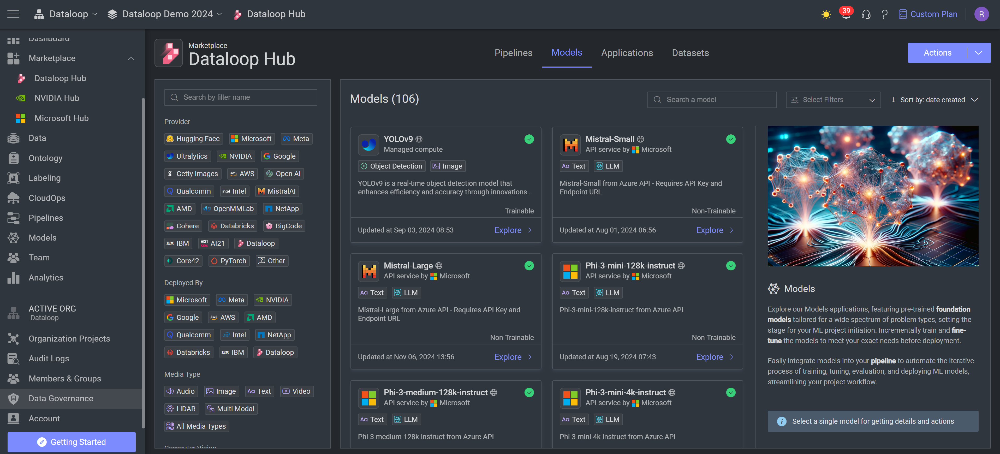
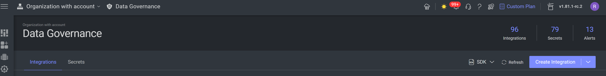
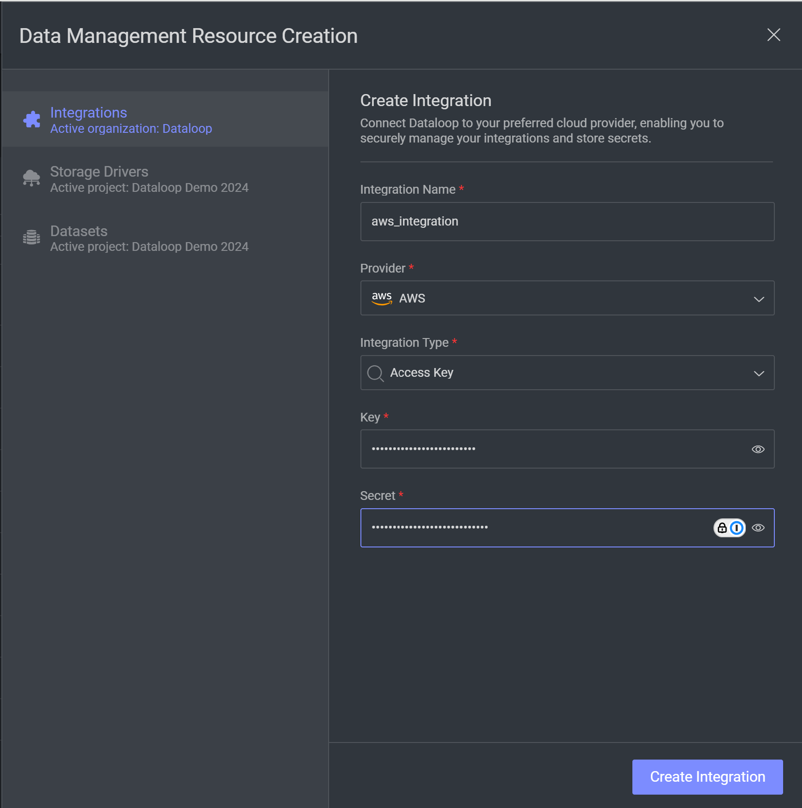

# Amazon Bedrock

## Introduction

Amazon Bedrock is a cloud-based service that offers high-performance foundation models (FM) from leading AI companies
such as
AI21 Labs, Anthropic, Cohere, Meta, Mistral AI, Stability AI and Amazon through a single API.
It provides tools for building generative AI applications and offers easy experimentation and evaluation of different
FMs
for your specific needs which can be further customized using techniques like fine-tuning and Retrieval Augmented
Generation (RAG).

## Description

This repo is an integration
between [Amazon Bedrock](https://docs.aws.amazon.com/bedrock/latest/userguide/what-is-bedrock.html)
models and [Dataloop](https://dataloop.ai/).

The Applications provide accesses to AWS Bedrock models, using the AWS SDK for Python (Boto3), as Dataloop model.

Available models:

* `Titan Text Models` - Amazon Titan Text models, with a context length of up to 8,000 tokens, excel in advanced
  language tasks like open-ended text generation, summarization, and conversational
  chat. [Titan Text](models/titan/README.md)

* `Titan Embeddings Models` - Amazon Titan Embeddings models are designed for converting text into high-quality
  embeddings, useful for tasks such as semantic search, clustering, and document classification with support for long
  context inputs.
  [Titan Embeddings](models/titan/README.md)

* `Cohere Embeddings Models` - Cohere Embeddings models focus on generating text embeddings for various tasks like
  information retrieval, similarity search, and document categorization with a strong emphasis on multilingual support.
  [Cohere Embeddings](models/cohere/README.md)

* `Claude Text Completions` - Claude Text Completion models specialize in natural, contextually aware text generation,
  excelling at creative writing, conversations, and generating coherent long-form content with high token limits.
  [Claude Text Completions](models/claude/README.md)

* `Claude MultiModel Models` - Claude MultiModel models leverage multimodal embeddings, allowing the combination of
  text,
  image, and other media inputs to provide richer, context-aware outputs for complex tasks across various domains.
  [Claude MultiModel](models/claude/README.md)

### Create Integration in Dataloop Platform:

1. Navigate to Data Governance Tab:

2. Choose `Create Integration`:

3. Create your integration:

* Choose a new name.
* Provider - 'AWS'.
* Insert your access key id and secret access key.
* Save and Create Integration.

### Installation - MarketPlace

Install the models from MarketPlace:

### Editing the configuration

All models are created with basic configurations. To edit configurations via the platform, go to the model page in the Model Management and edit the config.
Click [here](https://developers.dataloop.ai/tutorials/model_management/ai_library/chapter/#model-configuration) for more information. Check the configuration variables on each of the models to use them correctly.

### Amazon bedrock

create access
key: [Manage access keys for IAM users](https://docs.aws.amazon.com/IAM/latest/UserGuide/id_credentials_access-keys.html#rotating_access_keys_console)